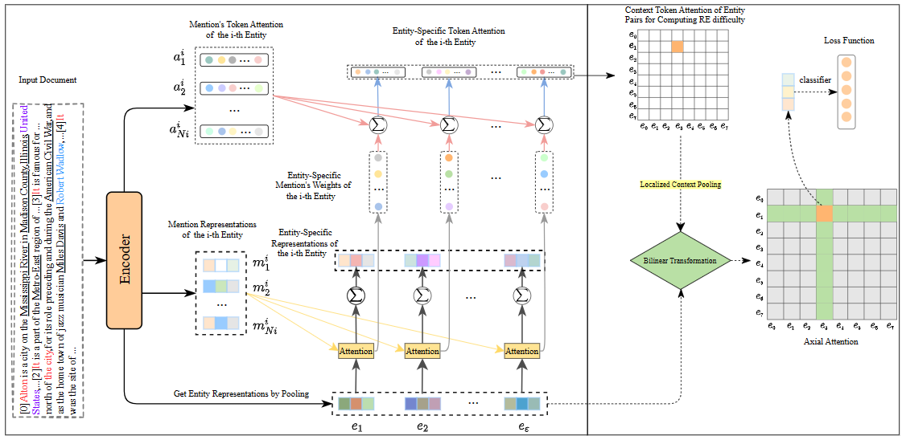

# MAN-SRE

This repository contains codes for the proposed model **MAN-SRE** (Entity-specific **M**ention **A**ttention **N**etwork and **S**elective **R**epresentation **E**nhancement).
<div  align="center">  

</div>  

## Requirements

Packages listed below are required.

- Python (tested on 3.8.16)
- CUDA (tested on 11.6)
- [PyTorch](http://pytorch.org/) (tested on 1.10.0+cu111)
- [Transformers](https://github.com/huggingface/transformers) (tested on 4.20.1)
- numpy (tested on 1.24.2)
- [opt-einsum](https://github.com/dgasmith/opt_einsum) (tested on 3.3.0)
- spacy (tested on 3.6.1)
- json
- tqdm

It is also possible to setup the environment by `pip install -r requirements.txt`.

## Dataset
* [DocRED](https://github.com/thunlp/DocRED)
* [DWIE](https://github.com/klimzaporojets/DWIE)
* Note that you should process DWIE to fit the same format as DocRED. Put the dataset into the directory `./data`.

## Train
The training process of model will be started after runing `python run.py`. And, you should set `--base_train` as `True` to perform the training of the first stage.
The second stage's training is carried out when setting  `--base_train` as `False`.

## Test
To get the result on test set, run:
```
python run.py --do_train False --do_predict
```
Then a test result file in the official evaluation format will be saved.
Compress and submit it to [CodaLab](https://competitions.codalab.org/competitions/20717) to get the final test score.


